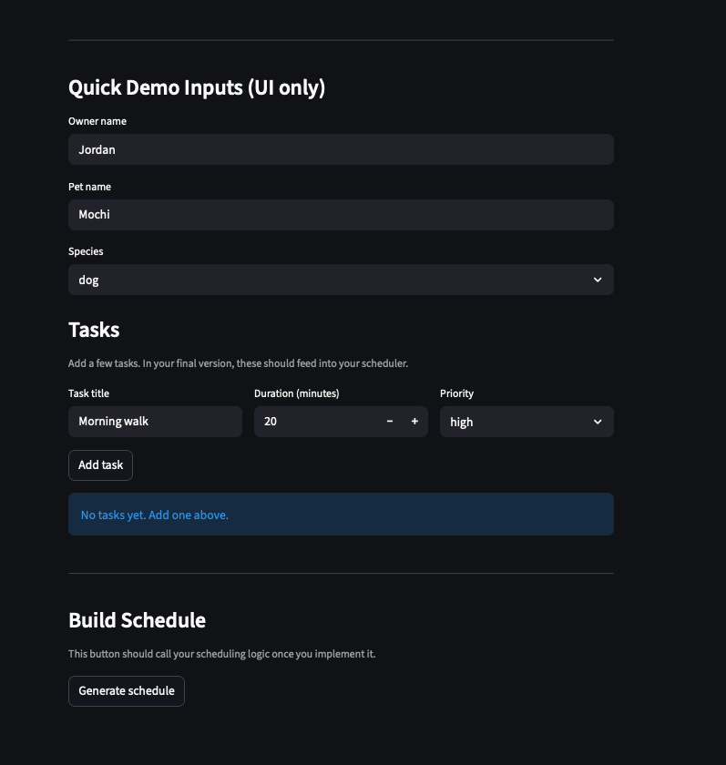

# PawPal+ (Module 2 Project)

You are building **PawPal+**, a Streamlit app that helps a pet owner plan care tasks for their pet.

## Scenario

A busy pet owner needs help staying consistent with pet care. They want an assistant that can:

- Track pet care tasks (walks, feeding, meds, enrichment, grooming, etc.)
- Consider constraints (time available, priority, owner preferences)
- Produce a daily plan and explain why it chose that plan

Your job is to design the system first (UML), then implement the logic in Python, then connect it to the Streamlit UI.

## What you will build

Your final app should:

- Let a user enter basic owner + pet info
- Let a user add/edit tasks (duration + priority at minimum)
- Generate a daily schedule/plan based on constraints and priorities
- Display the plan clearly (and ideally explain the reasoning)
- Include tests for the most important scheduling behaviors

## Getting started

### Setup

```bash
python -m venv .venv
source .venv/bin/activate  # Windows: .venv\Scripts\activate
pip install -r requirements.txt
```

### Suggested workflow

1. Read the scenario carefully and identify requirements and edge cases.
2. Draft a UML diagram (classes, attributes, methods, relationships).
3. Convert UML into Python class stubs (no logic yet).
4. Implement scheduling logic in small increments.
5. Add tests to verify key behaviors.
6. Connect your logic to the Streamlit UI in `app.py`.
7. Refine UML so it matches what you actually built.


## Features

* Priority-based scheduling with time constraints
* Chronological sorting of tasks using scheduled time
* Filtering tasks by completion status and pet
* Automated handling of recurring tasks (daily, weekly)
* Lightweight conflict detection for overlapping task times
* Clear explanations for why tasks are scheduled or skipped


## Smarter Scheduling

PawPal+ includes enhanced scheduling logic to better support real-world pet care routines.
The system automatically generates future tasks for recurring activities, detects scheduling conflicts when tasks overlap in time, and supports sorting and filtering to help owners understand and manage their daily plans more effectively.


## Testing PawPal+

Automated tests are included to verify the most important behaviors of the system, including task ordering, time limit enforcement, recurrence logic, and conflict detection.

### Run tests

```bash
python -m pytest
```

### Test coverage includes

* Correct task ordering by priority, duration, and time
* Skipping completed or over-limit tasks
* Creation of future tasks for recurring activities
* Detection of overlapping task schedules
* Validation of core data model behavior


## Confidence Level

System reliability: ★★★★☆ (4/5)

Tests cover core scheduling logic and edge cases. Additional confidence will come from expanded UI testing and real user interaction scenarios.

## Final Demo



